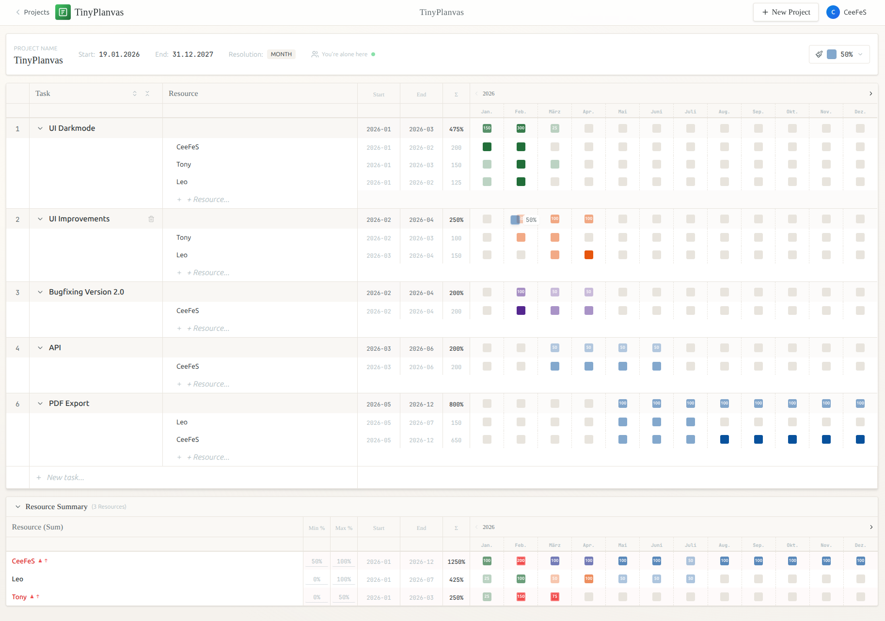
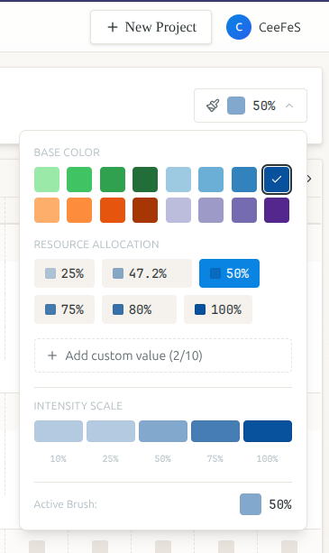
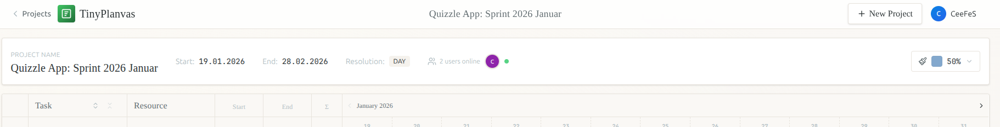

<div align="center">

# 🎨 TinyPlanvas

**A beautiful, visual resource planning tool with a GitHub-style allocation grid**

[](https://nextjs.org/)
[](https://pocketbase.io/)
[](https://www.docker.com/)
[](https://opensource.org/licenses/MIT)

<br />

> ℹ️ **Note:** 95% of this project was vibe-coded. Bugs and gaps are not excluded in this early version.

</div>

---

## 📸 Screenshots

<div align="center">

### Project Dashboard
*Overview of all your resource plans with resolution, owner, and sharing status*


---

### Resource Planning Grid
*Visual allocation grid with tasks, resources, color-coded workload, and automatic summaries*



---

### Multi-Color Brush System
*Choose from multiple colors and percentage values — create custom presets for your workflow*



---

### Real-Time Collaboration
*See who's online and work together — changes sync instantly across all users*



</div>

---

## 💡 Why TinyPlanvas?

As a project manager myself, I was looking for a simple, clear tool to create resource plans and Gantt-style overviews that I could easily share with my team. What I found: most tools try to do too much.

**All I wanted to know was:**
> *When does who do what — and at what percentage or effort?*

That's it. No complex dependency chains, no overloaded feature sets, no steep learning curves. Just a visual grid where I can see resource allocation at a glance.

So I built TinyPlanvas — a focused tool that does one thing well.

---

## ✨ What is TinyPlanvas?

TinyPlanvas is a **lightweight, visual resource planning tool** designed to make project scheduling intuitive and beautiful. Inspired by GitHub's contribution graph, it allows you to paint resource allocations across time using a simple brush-based interface.

### 🎨 Versatile Planning for Any Project

TinyPlanvas isn't limited to personnel planning — it's a **general-purpose resource allocation tool** that adapts to your needs:

| Use Case | Example |
|----------|---------|
| 👥 **Team Capacity** | Plan developer workload across sprints |
| 🚗 **Equipment & Assets** | Schedule vehicle or machine usage |
| 🏢 **Room Booking** | Visualize meeting room availability |
| 💰 **Budget Allocation** | Track spending across time periods |
| 📦 **Inventory Planning** | Plan stock levels and procurement |
| 🎯 **Target vs. Actual** | Create baseline plans, then track actual progress with different colors |

### 🖌️ Multi-Color Workflow

One of TinyPlanvas' unique features is the ability to work with **multiple colors**. This enables powerful workflows:

- **Target vs. Actual Plans** — Use one color for planned allocations, another for actual values
- **Category Coding** — Different colors for different project types or priorities
- **Status Tracking** — Green for confirmed, yellow for tentative, red for at-risk
- **Team Differentiation** — Each team member gets their own color

### 🎯 Perfect for:

- **Project Managers** — Plan team capacity across multiple projects
- **Team Leads** — Visualize workload distribution at a glance
- **Freelancers** — Track your own time allocation across clients
- **Operations Teams** — Schedule equipment, rooms, or any shared resource
- **Small Teams** — Collaborate on resource planning with real-time updates

### 🔑 Key Features

| Feature | Description |
|---------|-------------|
| 🖌️ **Paint-to-Plan** | Click and drag to paint allocations — as intuitive as using a brush |
| 📊 **Multi-Resolution** | View by Day, Week, Month, or Year — zoom in or out as needed |
| 🎨 **Color-Coded Workload** | Visual heatmap shows allocation intensity instantly |
| 👥 **Real-time Collaboration** | See changes from teammates live with PocketBase subscriptions |
| 🔐 **User & Permission System** | Share projects with view or edit access |
| 📱 **Responsive Design** | Works beautifully on desktop and tablet |
| 🌍 **Multi-Language** | Built-in i18n support (German & English) |
| 🐳 **One-Command Deploy** | Docker Compose setup for instant production deployment |

---

## 🚀 Quick Start (Development)

### Prerequisites

- Node.js 18+ 
- Docker & Docker Compose (for PocketBase)

### 1. Clone & Install

```bash
git clone https://github.com/yourusername/tinyplanvas.git
cd tinyplanvas
npm install
```

### 2. Start PocketBase (Backend)

```bash
npm run pocketbase:start
```

This spins up PocketBase in Docker with automatic migrations.

### 3. Start Development Server

```bash
npm run dev
```

Open [http://localhost:3000](http://localhost:3000) — create your first admin account and start planning! 🎉

---

## 🏭 Production Deployment

TinyPlanvas is designed for easy self-hosting with Docker Compose. Here's how to get it running in production:

### Option A: Quick Deploy (Recommended)

```bash
# 1. Clone the repository
git clone https://github.com/yourusername/tinyplanvas.git
cd tinyplanvas

# 2. (Optional) Configure environment
#    Create .env file for custom settings
cat > .env << EOF
APP_PORT=80
NEXT_PUBLIC_POCKETBASE_URL=
EOF

# 3. Build and start everything
docker compose up -d --build

# 4. Done! Access at http://your-server:80
```

### Option B: Step-by-Step

<details>
<summary>Click to expand detailed instructions</summary>

#### 1. Server Requirements

- Linux server (Ubuntu 22.04+ recommended)
- Docker Engine 24+
- Docker Compose v2+
- 1 GB RAM minimum (2 GB recommended)
- 10 GB disk space

#### 2. Clone Repository

```bash
git clone https://github.com/yourusername/tinyplanvas.git
cd tinyplanvas
```

#### 3. Configure Environment (Optional)

Create a `.env` file in the project root:

```env
# Port to expose the application (default: 80)
APP_PORT=80

# Leave empty for same-origin requests (recommended)
# Only set if running behind a different reverse proxy
NEXT_PUBLIC_POCKETBASE_URL=
```

#### 4. Build & Launch

```bash
# Build all containers
docker compose build

# Start in background
docker compose up -d

# Check status
docker compose ps

# View logs
docker compose logs -f
```

#### 5. First-Time Setup

1. Open `http://your-server-ip:80` in your browser
2. The setup wizard will guide you through creating the first admin account
3. That's it — start creating projects!

#### 6. Data Persistence

All data is stored in a Docker volume called `pocketbase_data`. To backup:

```bash
# Create backup
docker run --rm -v tinyplanvas_pocketbase_data:/data -v $(pwd):/backup alpine tar czf /backup/pb_backup.tar.gz /data

# Restore backup
docker run --rm -v tinyplanvas_pocketbase_data:/data -v $(pwd):/backup alpine tar xzf /backup/pb_backup.tar.gz -C /
```

</details>

### Architecture Overview

```
┌─────────────────────────────────────────────────────┐
│                    NGINX (Port 80)                  │
│              Reverse Proxy & Static Files           │
└────────────────────────┬────────────────────────────┘
                         │
          ┌──────────────┴──────────────┐
          │                             │
          ▼                             ▼
┌─────────────────────┐     ┌─────────────────────┐
│   Next.js Frontend  │     │     PocketBase      │
│    (Port 3000)      │────▶│     (Port 8080)     │
│   SSR + React SPA   │     │   Auth + Database   │
└─────────────────────┘     └─────────────────────┘
                                     │
                                     ▼
                            ┌─────────────────┐
                            │  SQLite Volume  │
                            │  (pb_data)      │
                            └─────────────────┘
```

---

## 🗺️ Roadmap

We have exciting features planned for TinyPlanvas! Here's what's coming:

| Status | Feature | Description |
|:------:|---------|-------------|
| 🔲 | **UI Improvements** | Enhanced visual polish, animations, and micro-interactions |
| 🔲 | **Dark Mode** | Easy on the eyes for late-night planning sessions 🌙 |
| 🔲 | **REST API** | Public API endpoints for integrations and automation |
| 🔲 | **Export: PDF** | Generate beautiful PDF reports of your project plans |
| 🔲 | **Export: XLSX** | Excel-compatible exports for stakeholder reporting |
| 🔲 | **Export: CSV** | Simple data export for analysis and backups |

### Future Ideas

- 📅 Calendar integration (iCal, Google Calendar)
- 📈 Analytics dashboard with utilization metrics
- 🔔 Notification system for overallocation warnings
- 🏷️ Tags and categories for resources
- 📱 Progressive Web App (PWA) support

> 💬 **Have a feature request?** Open an issue on GitHub!

---

## 🛠️ Tech Stack

| Layer | Technology |
|-------|------------|
| **Frontend** | Next.js 14, React 18, TypeScript |
| **Styling** | Tailwind CSS, custom "paper" design system |
| **State** | Zustand, TanStack Query |
| **Backend** | PocketBase (Go-based BaaS) |
| **Database** | SQLite (via PocketBase) |
| **Deployment** | Docker, Docker Compose, NGINX |
| **Icons** | Lucide React |

---

## 📂 Project Structure

```
tinyplanvas/
├── src/
│   ├── app/                 # Next.js App Router pages
│   ├── components/          # React components
│   │   ├── auth/           # Login & Setup screens
│   │   ├── grid/           # Planning grid & brush editor
│   │   ├── layout/         # Header, sidebar
│   │   ├── project/        # Project-specific components
│   │   ├── settings/       # Settings panels
│   │   └── ui/             # Reusable UI components
│   ├── lib/                 # Utilities, hooks, contexts
│   └── store/               # Zustand state management
├── pocketbase/
│   ├── pb_migrations/       # Database schema migrations
│   └── Dockerfile
├── nginx/
│   └── nginx.conf           # Reverse proxy configuration
├── docker-compose.yml       # Production deployment
└── package.json
```

---

## 🤝 Contributing

Contributions are welcome! Whether it's:

- 🐛 Bug reports
- 💡 Feature suggestions  
- 📝 Documentation improvements
- 🔧 Code contributions

Please feel free to open an issue or submit a pull request.

---

## 📄 License

This project is licensed under the MIT License — see the [LICENSE](LICENSE) file for details.

---

<div align="center">


*If you find TinyPlanvas useful, consider giving it a ⭐ on GitHub!*

[🐛 Report Bug](https://github.com/yourusername/tinyplanvas/issues) · [💡 Request Feature](https://github.com/yourusername/tinyplanvas/issues)

</div>
